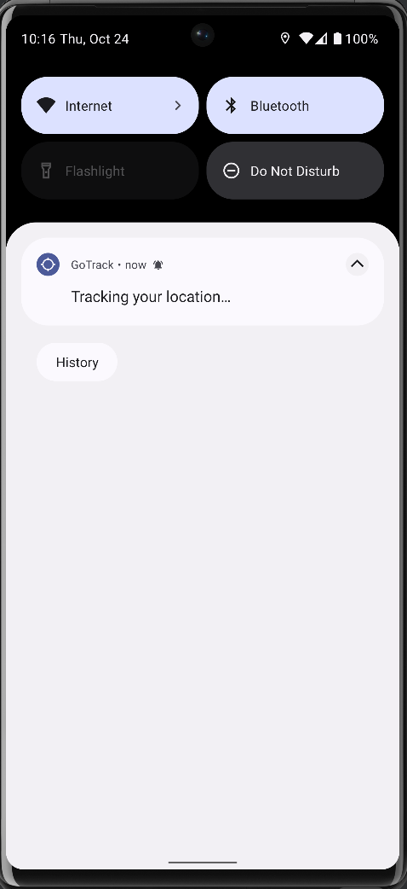

# GoTrack

Is an Android application that allows you to track locations and send them to a Firebase/Cloud Firestore server. The app also displays collected locations of authenticated users on a map.

## Technology Stack

- **Programming Language**: [Kotlin](https://kotlinlang.org/)
- **Architecture Pattern**: MVVM (Model-View-ViewModel)
- **Dependency Injection**: [Hilt](https://developer.android.com/training/dependency-injection/hilt-android)
- **Asynchronous Programming**: [Kotlin Flow](https://kotlinlang.org/docs/flow.html), [Coroutines](https://kotlinlang.org/docs/coroutines-overview.html)
- **Database**: [SQLite](https://www.sqlite.org/index.html) (with [Room](https://developer.android.com/training/data-storage/room))
- **Networking**: [Firebase](https://firebase.google.com)
- **Navigation**: Navigation component
- **View Layer**: XML (for layout design)
- **Localization**: Android resource system for localization

## Screenshots

|   |           |                                                |
|:-----------------------------------------:|:-------------------------------------------------:|:-----------------------------------------:     |
|    |          |                                                |
|   |  |       |
|     |       |                                                |       
|       |           | |                                                
## Features
- **Location tracking**: Track your location in real-time and send it to the server.
- **Map display**: View collected locations of authenticated users on a map.
- **Firebase integration**: Store and retrieve location data using Firebase/Cloud Firestore.
