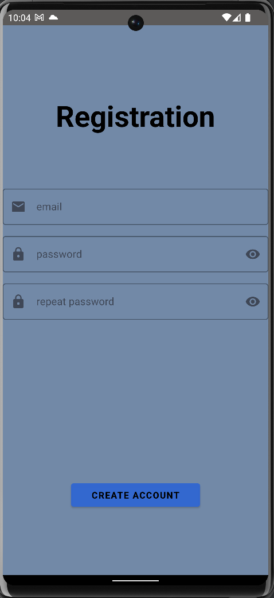
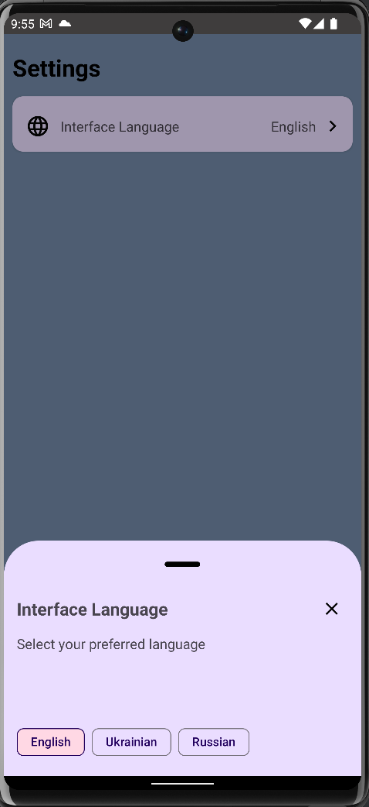
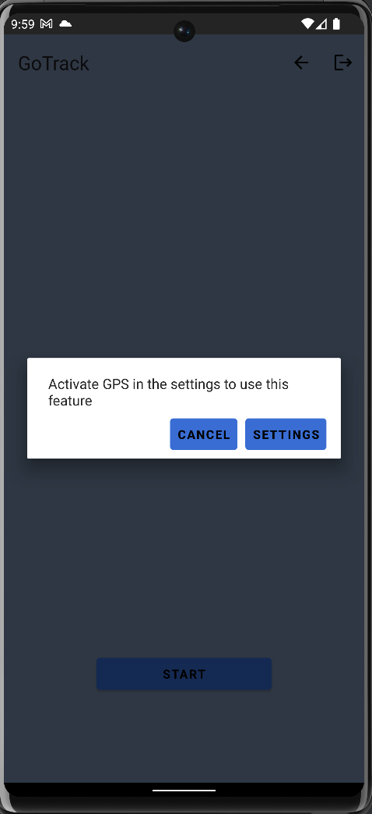
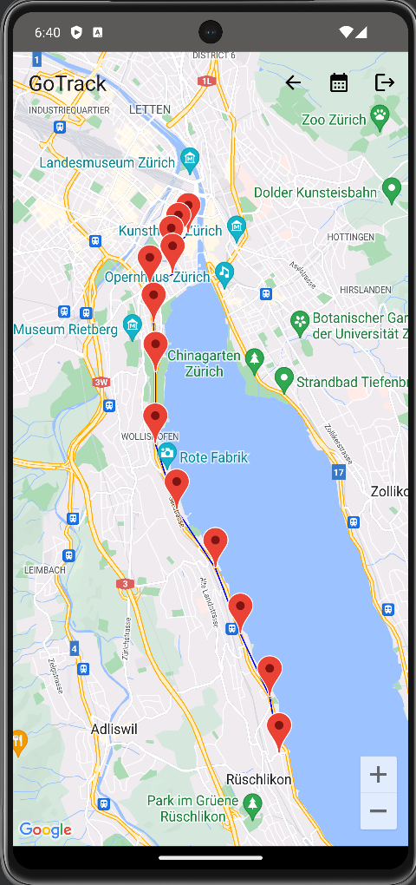

# GoTrack

This application enables users to track and filter their real-time location coordinates. With integrated mapping services, users can view their movement data on an interactive map. The app supports Firebase authentication, providing secure access and data storage. Users can save and retrieve their coordinates through Cloud Firestore.

## Technology Stack

- **Programming Language**: [Kotlin](https://kotlinlang.org/)
- **Architecture Pattern**: MVVM (Model-View-ViewModel)
- **Dependency Injection**: [Hilt](https://developer.android.com/training/dependency-injection/hilt-android)
- **Asynchronous Programming**: [Kotlin Flow](https://kotlinlang.org/docs/flow.html), [Coroutines](https://kotlinlang.org/docs/coroutines-overview.html)
- **Database**: [SQLite](https://www.sqlite.org/index.html) (with [Room](https://developer.android.com/training/data-storage/room))
- **Networking**: [Firebase](https://firebase.google.com)
- **Navigation**: Navigation component
- **View Layer**: XML (for layout design)
- **Localization**: Android resource system for localization

## Screenshots

### Authentication
|   |           |                                                |
|:-----------------------------------------:|:-------------------------------------------------:|:----------------------------------------------:|
### Main Dashboard
|    |          |           |                                    
### Tracking
|   |  |       |
|     |       |                                                | 

### Mapping
|       |           | |                                                
## Features
- **Location tracking**: Track your location in real-time and send it to the server.
- **Map display**: View collected locations of authenticated users on a map.
- **Firebase integration**: Store and retrieve location data using Firebase/Cloud Firestore.
- **Firebase Authentication**: User authentication and registration are managed using Firebase Auth, allowing users to create accounts and sign in securely.
